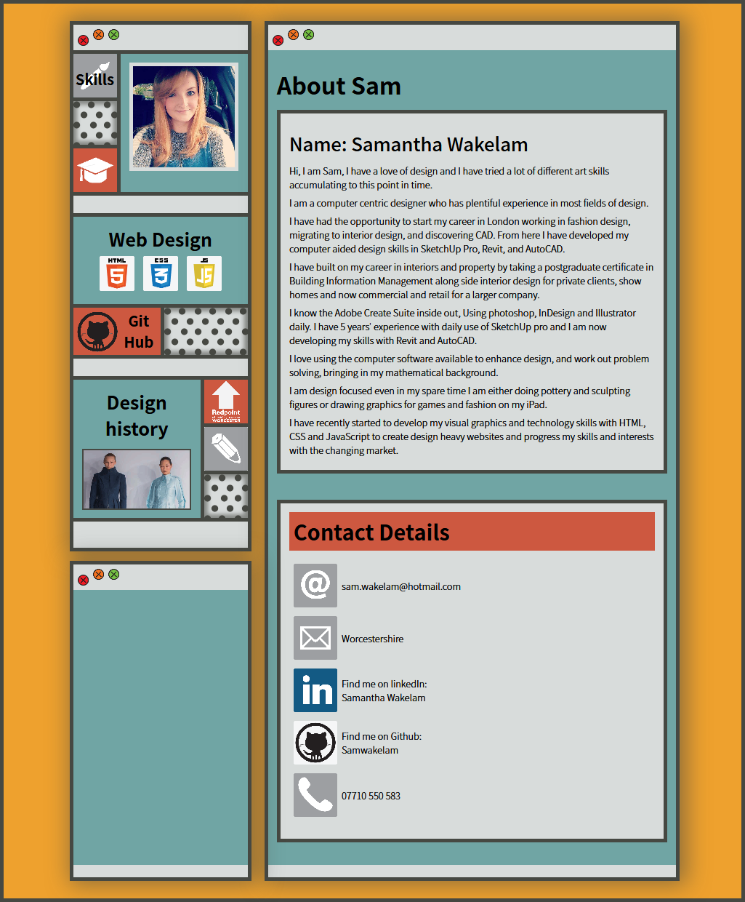
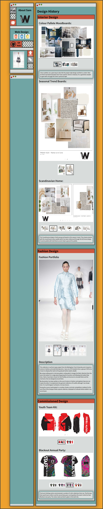
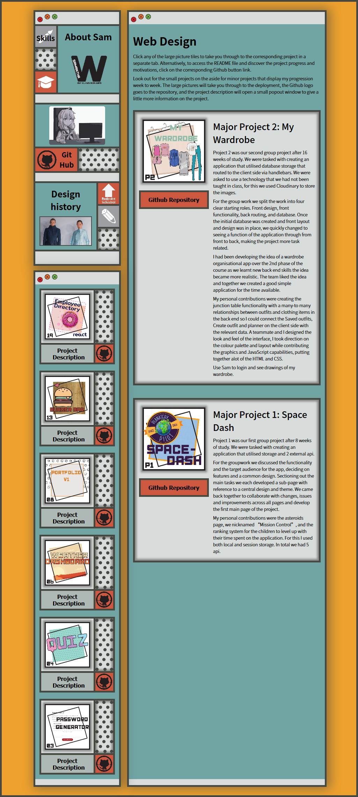

# Employee Directory - React 

This is a remodel of my portfolio built entirely in react with various npm packages included to maintain similar functionality to my week 8 portfolio. 

I have redesigned the full look of the website and created some different navigational elements. it is a demonstration of how much I have learnt in 20 intense weeks of Full stack web coding bootcamp.  

It is not yet mobile responsive but I aim for it to be in the short term. 

## Contents: 

1. [Screen Shots](#Screes-shots)
2. [Improvements](#Improvements)
3. [Updates](#Updates)
4. [Credits](#Credits)
5. [License](#License)
6. [Contact](#Contact)

This is not a project designed to be copied, the content is all copyright to myself and is original content not to be reproduced or used on any other site.

### Project dependencies

* React
* React-responsive npm package (future update). 
* React-responsive-carousel
* React-popper
* React-dom and react-router-dom
* gh-pages

### Technologies 

Languages I have used are:
* Javascript
* HTML
* CSS
* React

## Screen Shots 

## Improvements

Additions to be added: 
* Cv online and download copy for employers.
* Project 3 on completion of the course.
* Brand statment needs readdressing on the front page. 

I would like to add: 
* Mobile Responsiveness.
* There is plenty of white space in areas, this needs content adding or feature readjustment where appropriate. 
* The deployment has known routing issues through github pages and so the refresh ability results in a 404, this needs addressing when I have more time.

I have considered that it might be benificial to store some of my information skills and design data in a database that can then be called and mapped into components for better use of the react application. 

## Updates 

There are no updates at this time.
    
## Credits 

Resources I have referenced:   
* docs.mongodb.com
* mongoosejs.com

## License 

* GNU GPL v3   

Where appropriate: 
Alot of the graphics included in my projects I have drawn myself and are copyright 2021. 
No useage without permission. 
If I have not originated the imagery I have gained the permission of the owner and acreditied 
where necessary. These are also not for re-purpose without permission of the owner.

You must make reference where the code originated. I would also love to see what changes and improvements you make.  
Design by Samantha Wakelam, please respect copyright 2020. 

## Contact

* Name: Samantha Wakelam   Email: sam.wakelam@hotmail.co.uk  Github Profile: Sam Wakelam 
